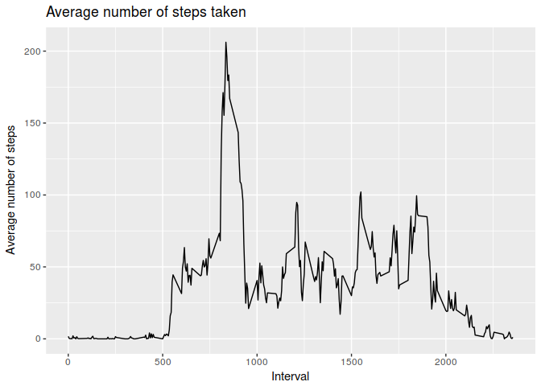

# Reproducible Research: Peer Assessment 1
Hannon Queiroz  


## Loading necessary libraries

```r
library(data.table)
library(dplyr)
library(ggplot2)
library(chron)
```


## Loading and preprocessing the data

```r
activities <- fread('unzip -cq activity.zip')
activities$date <- as.Date(activities$date, "%Y-%m-%d")
print(head(activities))
```

```
##    steps       date interval
## 1:    NA 2012-10-01        0
## 2:    NA 2012-10-01        5
## 3:    NA 2012-10-01       10
## 4:    NA 2012-10-01       15
## 5:    NA 2012-10-01       20
## 6:    NA 2012-10-01       25
```

## What is mean total number of steps taken per day?
1. Calculate the total number of steps taken per day (ignoring NAs)

```r
steps_per_day <- activities %>%
    group_by(date) %>%
    summarise(
        total_steps = sum(steps, na.rm=TRUE)    
    )
print(head(steps_per_day))
```

```
## # A tibble: 6 × 2
##         date total_steps
##       <date>       <int>
## 1 2012-10-01           0
## 2 2012-10-02         126
## 3 2012-10-03       11352
## 4 2012-10-04       12116
## 5 2012-10-05       13294
## 6 2012-10-06       15420
```

2. Make a histogram of the total number of steps taken each day

```r
hist(steps_per_day$total_steps,
     main = "Histogram of total setps taken per day",
     xlab = "Total Steps",
     col = "blue")
```

<!-- -->

3. Calculate and report the mean and median of the total number of steps taken per day

```r
steps_mean <- mean(steps_per_day$total_steps, na.rm = TRUE)
steps_median <- median(steps_per_day$total_steps, na.rm = TRUE)
```
The mean of the total steps taken per day is 9354.2295082.  
The mediean of the total steps taken per day is 10395.  


## What is the average daily activity pattern?
1. Make a time series plot (i.e. type = "l") of the 5-minute interval (x-axis) and the average number of steps taken, averaged across all days (y-axis)

```r
steps_interval <- activities %>%
    group_by(interval) %>%
    summarise(
        number_steps = mean(steps, na.rm = TRUE)
    )

print(head(steps_interval))
```

```
## # A tibble: 6 × 2
##   interval number_steps
##      <int>        <dbl>
## 1        0    1.7169811
## 2        5    0.3396226
## 3       10    0.1320755
## 4       15    0.1509434
## 5       20    0.0754717
## 6       25    2.0943396
```

```r
ggplot(data = steps_interval, aes(x = interval, y = number_steps)) + 
    ggtitle("Average number of steps taken") +
    xlab("Interval") +
    ylab("Average number of steps") +
    geom_line()
```

<!-- -->


2. Which 5-minute interval, on average across all the days in the dataset, contains the maximum number of steps?

```r
max_interval = arrange(steps_interval, desc(number_steps))[1,]
print(max_interval)
```

```
## # A tibble: 1 × 2
##   interval number_steps
##      <int>        <dbl>
## 1      835     206.1698
```

The 5-minute inteval that contains, on average, the maximum number of steps is inteval 835, with 206.1698113 steps.


## Imputing missing values
1. Calculate and report the total number of missing values in the dataset (i.e. the total number of rows with NAs)

```r
number_na <- sum(is.na(activities$steps))
```
There are **2304** missing values in the dataset.

2. Devise a strategy for filling in all of the missing values in the dataset. The strategy does not need to be sophisticated. For example, you could use the mean/median for that day, or the mean for that 5-minute interval, etc.

```r
impute.mean <- function(x) replace(x, is.na(x), mean(x, na.rm = TRUE))
```

3. Create a new dataset that is equal to the original dataset but with the missing data filled in.  

Let's fill in the missing values based on the mean for a given 5-minute interval:

```r
activities2 <- activities %>%
    group_by(interval) %>%
    mutate(
        steps = impute.mean(steps)
    )
print(head(activities2))
```

```
## Source: local data frame [6 x 3]
## Groups: interval [6]
## 
##       steps       date interval
##       <dbl>     <date>    <int>
## 1 1.7169811 2012-10-01        0
## 2 0.3396226 2012-10-01        5
## 3 0.1320755 2012-10-01       10
## 4 0.1509434 2012-10-01       15
## 5 0.0754717 2012-10-01       20
## 6 2.0943396 2012-10-01       25
```

4. Make a histogram of the total number of steps taken each day  

```r
steps_per_day <- activities2 %>%
    group_by(date) %>%
    summarise(
        total_steps = sum(steps)    
    )
hist(steps_per_day$total_steps,
     main = "Histogram of total setps taken per day",
     xlab = "Total Steps",
     col = "blue")
```

<!-- -->

4.1 Calculate and report the mean and median total number of steps taken per day.

```r
steps_mean <- mean(steps_per_day$total_steps)
steps_median <- median(steps_per_day$total_steps)
```
The mean of the total steps taken per day is **10766.19**.

The mediean of the total steps taken per day is **10766.19**.

4.2 Do these values differ from the estimates from the first part of the assignment? What is the impact of imputing missing data on the estimates of the total daily number of steps?

Yes, the values differ from the first estimates. The impact of imputing missing data is that the distribution becomes closer to a normal distribution.

## Are there differences in activity patterns between weekdays and weekends?
1. Create a new factor variable in the dataset with two levels – “weekday” and “weekend” indicating whether a given date is a weekday or weekend day.

```r
activities2$type_day <- as.factor(ifelse(is.weekend(activities2$date), "Weekend", "Weekday"))
steps_interval <- activities2 %>%
    group_by(interval, type_day) %>%
    summarise(
        number_steps = mean(steps, na.rm = TRUE)
    )
```

2. Make a panel plot containing a time series plot (i.e. type = "l") of the 5-minute interval (x-axis) and the average number of steps taken, averaged across all weekday days or weekend days (y-axis).

```r
ggplot(data = steps_interval, aes(x = interval, y = number_steps)) + 
    ggtitle("Average number of steps taken") +
    xlab("Interval") +
    ylab("Average number of steps") +
    geom_line() +
    facet_grid(.~type_day)
```

<!-- -->
